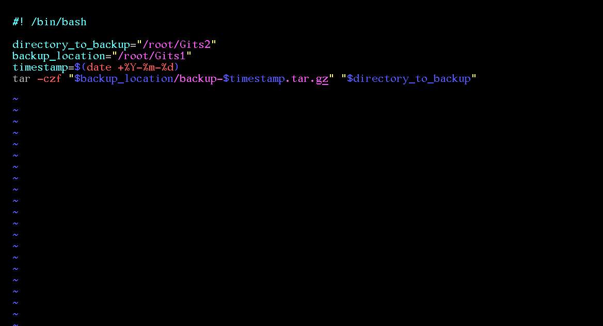
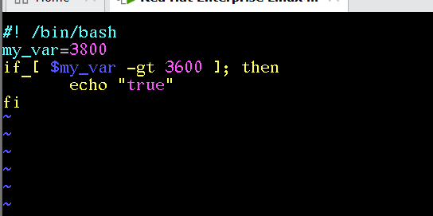

# Day 03 — Bash Scripting

## What I learned today:

### What is a Bash Script?
- A script is a set of Linux commands stored in a file that can be executed multiple times, instead of running each command manually every time
- Automates multiple commands for complex/repeated tasks
- If used with extension: `.sh`
- If used without extension: needs `chmod +x` (execute permission) to run directly

### Shebang Line
- `#!/bin/bash` — tells the terminal which interpreter to use to directly execute the file
- If not mentioned, the system uses the default interpreter
- Points to where bash is located (can check with `which bash`)

### Ways to Execute a Script
- `bash file.sh`
- `sh file.sh`
- `./file.sh` — needs execute permission first (`chmod +x file.sh`)

### Comments
- `#` — used to write a comment, not executed as code

### Sample Task: Create Folders & Print Directory
- Goal: create a folder, create three directories inside it, go into one, and print the current path
- Example script:
  - `#!/bin/bash`
  - `mkdir myfolder`
  - `cd myfolder`
  - `mkdir src bin bash`
  - `cd src`
  - `pwd`
- Run using: `bash file.sh` or `sh file.sh` or `./file.sh`

---

### Variables
- A variable is a bucket that stores something in memory
- Create a variable: `new=90` (no spaces around `=`)
- Refer to it: `$new`
- `echo "$new"` — expands the variable, prints its value (e.g., 90)
- `echo '$new'` — treats it as literal text, does not expand the variable
- Current directory as a variable: `current_directory=$(pwd)`
- Subshell — `$(command)` is a variable that stores the output of a command
- If a variable doesn't exist: `echo $new` gives blank output, not an error
- Environment variables — existing/built-in variables; any process running will have access to them
- `env` — command to see all environment variables

---

### Real-World Example: Backup Script
- Goal: automate backup of a directory, save it with a timestamp
- Example script:
  - `#!/bin/bash`
  - `directory_to_backup="/root/GitS2"`
  - `directory_backup_location="/root/myproject"`
  - `current_timestamp=$(date +%Y-%m-%d-%H-%M-%S)`
  - `tar -czf "$directory_backup_location/backup-$current_timestamp.tar.gz" "$directory_to_backup"`
- If path shouldn't be hardcoded, use positional parameters instead:
  - `$1` — first argument passed to the script (path to back up)
  - `$2` — second argument passed to the script (backup destination)
  - Example run: `bash backup.sh /path/to/backup /path/to/location`

---

### `expr` — Mathematical Operations
- Used for operations that can be mathematically evaluated
- `expr 10 + 2`
- `expr 10 / 2`
- `expr 10 - 2`
- For multiplication, `*` must be escaped: `expr 10 \* 2`

---

### Conditionals — Decision Making in Bash Scripts
- Basic syntax:
  - `if [ condition ]; then`
  - `    echo "condition true"`
  - `elif [ condition2 ]; then`
  - `    echo "another condition true"`
  - `else`
  - `    echo "condition false"`
  - `fi`
- `fi` — closes the if block
- Spacing inside `[ ]` matters in bash (space is required around brackets and condition)
- Example: `if [ $myvar -lt 300 ]; then echo "condition true"; else echo "condition false"; fi`
  

**Comparison operators:**
- `-eq` equal
- `-ne` not equal
- `-lt` less than
- `-gt` greater than
- `-le` less than or equal to
- `-ge` greater than or equal to

**Arithmetic operators:**
- `+`, `-`, `*`, `%`, `**` (power) — e.g., `2**3 = 8`

**Logical operators:**
- `&&` — AND
- `!` — NOT

---

### File Test Operators
- Used to check if a file exists and its type/permissions
- `-e` — file exists
- `-d` — is a directory
- `-f` — is a regular file
- `-r` — is readable
- `-w` — is writable
- `-x` — is executable
- `-s` — file exists and is not empty
- `-L` — is a symbolic link
- Example: `if [ -e file.txt ]; then echo "file exists"; fi`

---

### Assignment Operators
- `+=` — add and assign, e.g., `myvar+=5`
- `-=` — subtract and assign
- `*=` — multiply and assign
- `/=` — divide and assign
- `%=` — modulo and assign

---

### Checking If a Command Exists
- Used to check whether a tool/command is available before using it in a script
- Example: `if command -v curl &> /dev/null; then echo "curl is available"; fi`

### Using Conditions to Check User Input
- Scripts can check arguments passed by the user to decide which action to run
- Example: `if [ "$1" == "install" ]; then echo "Install command selected"; fi`

---
**Takeaway:** Covered core Bash scripting today — shebang lines, ways to execute scripts, variables and quoting differences, positional parameters, a real backup script example, mathematical operations with `expr`, conditionals with comparison/logical operators, file test operators, and assignment operators. Foundational for automating deployment and operational tasks in a DevOps role.
